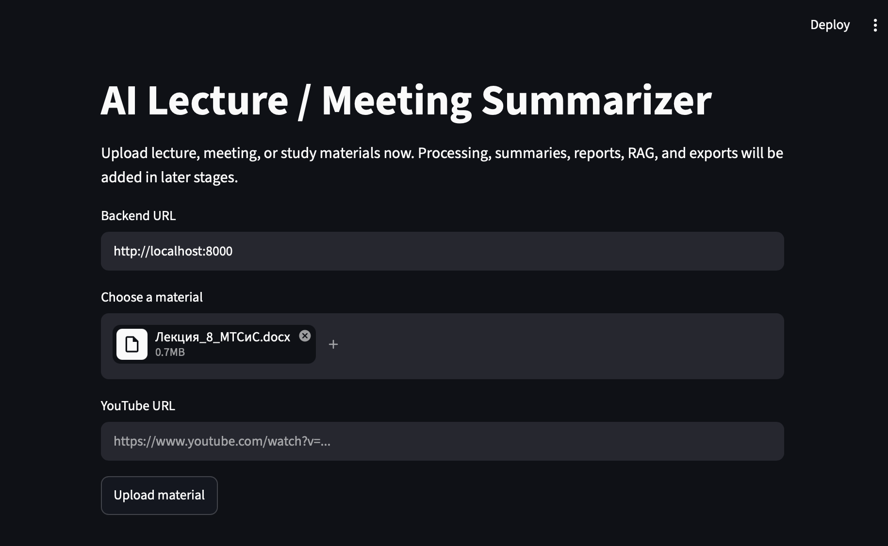
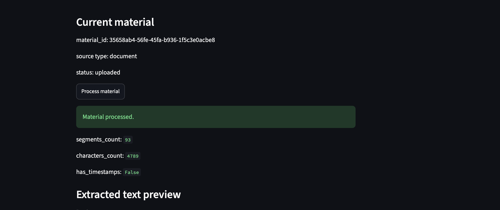
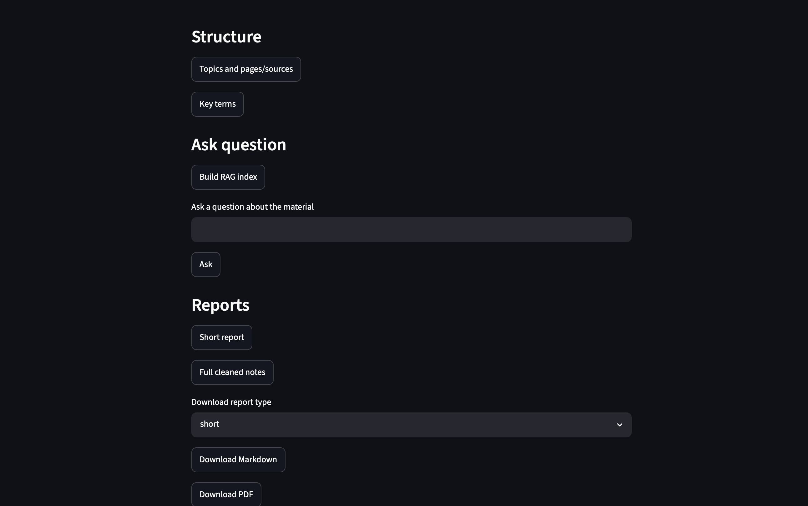

# AI Lecture / Meeting Summarizer

Проект принимает учебные материалы, лекции, встречи, документы, аудио/видео или YouTube-ссылки, извлекает текст, разбивает материал на сегменты, выделяет структуру, генерирует краткие и полные отчёты, поддерживает RAG-вопросы по материалу и экспортирует результаты в Markdown, PDF и DOCX.

Это портфолио-MVP для демонстрации backend-пайплайна обработки материалов и простого web-интерфейса. Проект не является продакшен-сервисом и не реализует автономного агента: каждое действие запускается пользователем через API или Streamlit UI.

## Возможности

- загрузка материалов: PDF, DOCX, TXT, MD, MP3, WAV, MP4, MOV;
- добавление YouTube-лекции по ссылке;
- обработка материала и извлечение текста;
- разбиение текста на сегменты;
- просмотр количества сегментов и символов;
- выделение тем и источников/страниц;
- выделение ключевых терминов;
- построение RAG-индекса;
- ответы на вопросы по загруженному материалу;
- генерация краткого отчёта;
- генерация полного очищенного конспекта;
- экспорт отчётов в Markdown, PDF и DOCX;
- FastAPI backend;
- Streamlit web-интерфейс.

## Скриншоты интерфейса

### Загрузка материала



### Обработка материала и извлечённый текст



### RAG, отчёты и экспорт



## Архитектура проекта

```text
Пользователь → Streamlit UI → FastAPI Backend → Services → Storage/Outputs
```

- Streamlit отвечает за пользовательский интерфейс: загрузку файлов, добавление YouTube-ссылок, запуск обработки, просмотр результатов, вопросы к материалу и скачивание отчётов.
- FastAPI отвечает за API и запуск backend-пайплайна: загрузку материалов, обработку, генерацию структуры, отчётов, RAG-индекса и экспортов.
- Services отвечают за обработку файлов, извлечение текста, транскрибацию, отчёты, RAG и экспорт.
- Результаты сохраняются в папках проекта: `data/uploads/`, `data/processed/`, `data/reports/`, `data/vector_db/`.

Основной пайплайн:

```text
загрузка файла / YouTube URL
-> определение типа источника
-> извлечение текста или транскрипта
-> сохранение segments.json и extracted_text.txt
-> выделение тем и терминов
-> генерация отчётов
-> построение TF-IDF RAG-индекса
-> ответы на вопросы по материалу
-> экспорт Markdown / PDF / DOCX
```

Дополнительные материалы: [архитектура](docs/architecture.md), [обзор API](docs/api_overview.md), [демо-сценарий](docs/demo_scenario.md).

## Стек технологий

- Python
- FastAPI
- Uvicorn
- Streamlit
- Pydantic и pydantic-settings
- OpenAI SDK для LLM API, совместимого с OpenRouter
- scikit-learn TF-IDF и cosine similarity для локального RAG/vector search
- joblib для сохранения TF-IDF индекса
- faster-whisper для speech-to-text по аудио
- ffmpeg для извлечения аудиодорожки из видео
- youtube-transcript-api для получения доступных YouTube-транскриптов
- pypdf для извлечения текста из PDF
- python-docx для чтения DOCX и экспорта DOCX
- ReportLab для PDF-экспорта
- Docker и Docker Compose
- pytest, httpx

В проекте нет LangChain, ChromaDB и yt-dlp; текущий RAG реализован локально через TF-IDF.

## Структура проекта

```text
ai-lecture-meeting-summarizer/
├── backend/
│   └── app/
│       ├── main.py
│       ├── api/
│       ├── services/
│       ├── schemas/
│       └── config.py
├── frontend/
│   └── app.py
├── data/
│   ├── uploads/
│   ├── processed/
│   ├── reports/
│   └── vector_db/
├── sample_data/
├── scripts/
├── tests/
├── docs/
│   ├── images/
│   ├── api_overview.md
│   ├── architecture.md
│   └── demo_scenario.md
├── requirements.txt
├── Dockerfile
├── docker-compose.yml
├── Makefile
└── README.md
```

## Быстрый старт

Создайте и активируйте виртуальное окружение:

```bash
python -m venv .venv
source .venv/bin/activate
```

Установите зависимости:

```bash
pip install -r requirements.txt
```

Запустите backend:

```bash
uvicorn backend.app.main:app --reload
```

В другом терминале запустите frontend:

```bash
streamlit run frontend/app.py
```

Локальные адреса:

- FastAPI: `http://localhost:8000`
- FastAPI docs: `http://localhost:8000/docs`
- Streamlit UI: `http://localhost:8501`

Те же команды доступны через `Makefile`:

```bash
make install
make run-backend
make run-frontend
```

## Запуск через Docker

Создайте локальный файл окружения:

```bash
cp .env.example .env
```

Соберите и запустите сервисы:

```bash
docker compose build
docker compose up
```

Или через `Makefile`:

```bash
make docker-build
make docker-up
```

Docker-адреса:

- FastAPI: `http://localhost:8000`
- FastAPI docs: `http://localhost:8000/docs`
- Streamlit UI: `http://localhost:8501`

Папка `data/` монтируется в контейнеры, поэтому загруженные файлы, обработанные тексты, отчёты и RAG-индексы сохраняются на хосте. Docker-образ устанавливает `ffmpeg`, необходимый для извлечения аудио из видео.

Остановка Docker Compose:

```bash
docker compose down
```

Или:

```bash
make docker-down
```

## Демо

В репозитории есть пример учебного материала:

```text
sample_data/ml_lecture_sample.txt
```

Ручной сценарий демонстрации описан в [docs/demo_scenario.md](docs/demo_scenario.md).

Также можно запустить smoke demo против уже работающего backend:

```bash
python scripts/smoke_demo.py
```

Скрипт загружает пример, запускает обработку, генерирует отчёты, темы и термины, строит RAG-индекс, задаёт вопрос и скачивает Markdown-отчёт.

## Переменные окружения

Скопируйте `.env.example` в `.env` и настройте значения при необходимости:

```bash
cp .env.example .env
```

Основные переменные:

- `BACKEND_URL` - адрес backend для Streamlit. Локально используется `http://localhost:8000`, в Docker Compose frontend получает `http://backend:8000`.
- `OPENROUTER_API_KEY` - опциональный ключ для реальной LLM-генерации. Если ключ не указан, используются детерминированные fallback-ответы для разработки и тестов.
- `OPENROUTER_BASE_URL` - базовый URL OpenRouter-compatible API.
- `LLM_MODEL` - имя chat-модели.
- `STT_MODEL_SIZE`, `STT_DEVICE`, `STT_COMPUTE_TYPE` - настройки `faster-whisper`.
- `STT_USE_FAKE_TRANSCRIBER` - режим тестовой транскрибации без загрузки модели.
- `YOUTUBE_USE_FAKE_TRANSCRIPT` - режим тестового YouTube-транскрипта без обращения к внешним сервисам.
- `YOUTUBE_LANGUAGES` - предпочтительные языки YouTube-транскриптов, например `ru,en`.

Первая реальная транскрибация через `faster-whisper` может занять время из-за загрузки и инициализации модели. Обработка YouTube использует доступные транскрипты/субтитры и не скачивает видео или аудио.

## API

Интерактивная документация FastAPI доступна после запуска backend:

```text
http://localhost:8000/docs
```

Ключевые группы маршрутов:

- `GET /health` - проверка доступности backend.
- `POST /materials/upload` - загрузка файла.
- `POST /materials/youtube` - добавление YouTube-материала по ссылке.
- `POST /materials/{material_id}/process` - обработка материала.
- `GET /materials/{material_id}/text` и `GET /materials/{material_id}/segments` - просмотр извлечённого текста и сегментов.
- `POST /materials/{material_id}/topics/generate` - выделение тем.
- `POST /materials/{material_id}/terms/generate` - выделение терминов.
- `POST /materials/{material_id}/rag/build` - построение RAG-индекса.
- `POST /materials/{material_id}/ask` - вопрос по материалу.
- `POST /materials/{material_id}/reports/short` - краткий отчёт.
- `POST /materials/{material_id}/reports/full-clean` - полный очищенный конспект.
- `GET /materials/{material_id}/download/md` - скачивание Markdown.
- `GET /materials/{material_id}/download/pdf` - скачивание PDF.
- `GET /materials/{material_id}/download/docx` - скачивание DOCX.

Подробный список групп API есть в [docs/api_overview.md](docs/api_overview.md).

## Тесты

```bash
pytest
```

Или:

```bash
make test
```

Тесты рассчитаны на запуск без OpenRouter API, реальной загрузки Whisper-модели, доступа к YouTube, GPU и видеофикстур, завязанных на `ffmpeg`.

## Ограничения

- Проект является портфолио-MVP, а не готовым многопользовательским продакшен-сервисом.
- Генерация отчётов, тем, терминов и LLM-ответов использует внешний LLM только при настроенном `OPENROUTER_API_KEY`; без ключа включаются резервные ответы для локальной разработки и тестов.
- Для длинных документов часть prompt-ов использует усечение текста; map-reduce обработка пока не реализована.
- RAG использует локальный TF-IDF retriever, а не embedding-модель и не векторную базу уровня ChromaDB/FAISS.
- YouTube-обработка зависит от доступности транскриптов/субтитров у конкретного видео.
- Реальная обработка аудио/видео может занимать время и требует установленного `ffmpeg`.

## Статус проекта

Портфолио-MVP. Основной backend-пайплайн, Streamlit-интерфейс, экспорт отчётов, тесты и Docker-запуск реализованы.
